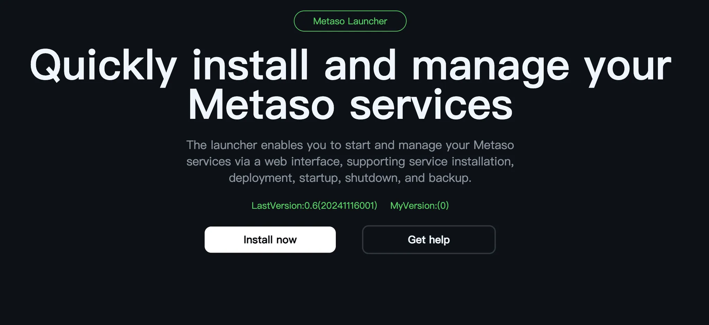
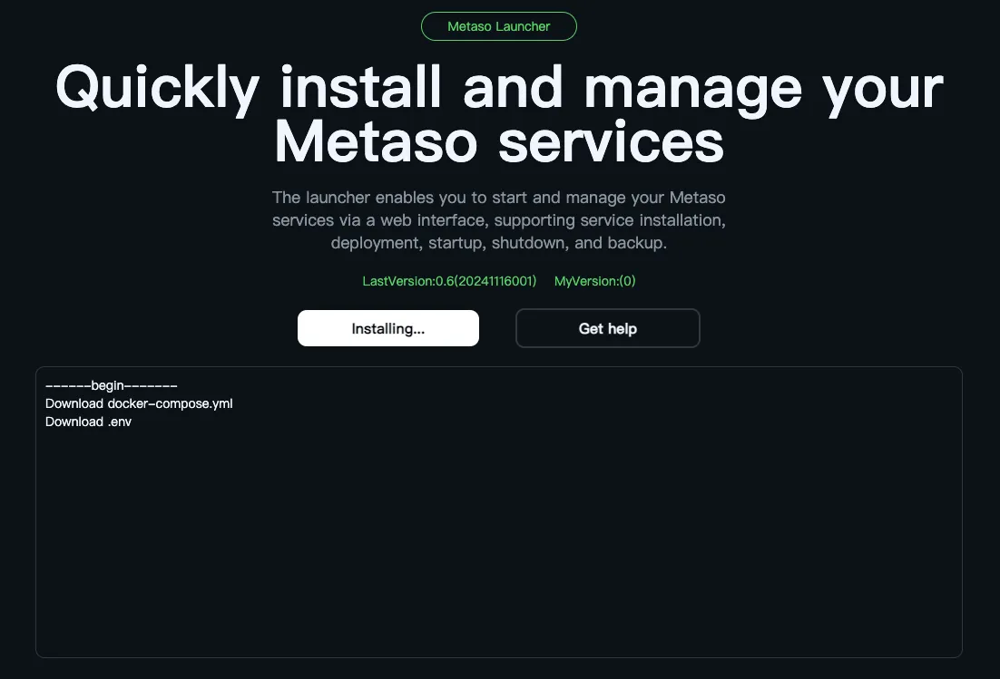
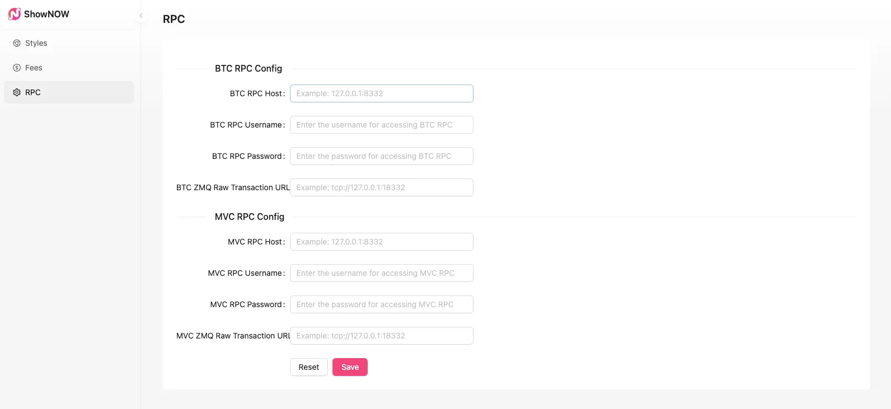

# MetaSo

[](README.md)
[](README-zh.md)

MetaSo是一个基于MetaID-v2和MAN实现去中心化的开源基础服务包，集成最基础的链上相关MetaID社交数据，类似比特币节点一样便于任何人都能运行一个去中心化社交节点， 不同的是MetaSo只专注于社交数据而非交易数据。

# Base Protocols  集成的基础协议

### 公开社交类：Simplebuzz/paylike/paycomment/simplerepost

Simplebuzz

path:  `/protocols/simplebuzz`

```json
{
    "content": "{Content}",
    "contentType": "{Content Format, default is text/plain}",
    "quotePin": "{Referenced/Quoted PinID}",
    "attachments": [
        "{metafile://PinID1}",
        "{metafile://PinID2}"
    ],
    "mention": [
        "{metaID1}",
        "{metaID2}"
    ]
}
```

paylike

path:  `/protocols/paylike`

```json
{
	"isLike":"1", 
	"likeTo":"9bc429654d35a11e5dde0136e3466faa03507d7377769743fafa069e38580243i0"
}
```

paycomment

path:  `/protocols/paycomment`

```json
{
	"content":"Nice comment",
	"commentTo":"c36feccf58b1a83c4df8a0b1517b74cf147509c1e25f4796ec493b1579a263f5i0",
	"replyTo":"", 
	"pay":"",
	"payTo": "",
}
```

simplerepost

path:  `/protocols/simplerepost`

```json
{
	"rePostComment":"let me repost thisbuzz",
	"rePostTx:":"c36feccf58b1a83c4df8a0b1517b74cf147509c1e25f4796ec493b1579a263f5i0",
}
```

### 权限类：PayBuzz/SubscribeBuzz/AccessControl/AccessPass

`subscribebuzz` 

path:  `/protocols/subscribebuzz`

```json
{
    "publicContent": "{The public content}", //公开预览部分
    "encryptContent": "{Encrypted Content}", //密文
    "contentType": "{Content Format, default is text/plain}",
    "publicFiles": [
		    "metafile://{pinid-1}", 
			  "metafile://{pinid-2}",
			  ...,
		],
    "encryptFiles": [
		    "metafile://{pinid-21}", 
		    "metafile://{pinid-22}",
		    ...,
		 ],
}
```

`paybuzz` 

path: `/protocols/paybuzz`

```json
{
    "publicContent": "{The public content}", //公开预览部分
    "encryptContent": "{Encrypted Content}", //密文
    "contentType": "{Content Format, default is text/plain}",
    "publicFiles": [
		    "metafile://{pinid-1}", 
			  "metafile://{pinid-2}",
			  ...,
		],
    "encryptFiles": [
		    "metafile://{pinid-21}", 
		    "metafile://{pinid-22}",
		    ...,
		 ],
}
```

`accesscontrol`

path:  `/metaaccess/accesscontrol`

```json
{
	"publicContent": "public part of content",//公开部分内容
	"publicPins":["PINID-1", "PINID-2"],//公开部分文件
	"publicPath": "/protocols/simplepublicbuzz",~~
	"controlPins":["PINID1","PINID2"], //Array of 'paybuzz' PINs that will be in control of accessing
	"controlPath": "/protocols/metaaccess/subscribebuzz",//The 'subscribebuzz' pins which is in this path will be in control of accessing
	"manDomain":"",//待定
	"manPubkey":"THE-PUBKEY-OF-MAN", //Pubkey of the MAN node providing custody decryption services.
	"creatorPubkey":"THE-PUBKEY-OF-CREATOR",//Pubkey of the creator
	"encryptedKey":"Use the ECDH Key to Decrypt it and use that decryptedkey to decrypt the content",
	"holdCheck":{//hold检查
		"type":"mrc20" //"chainCoin" or "mrc20", 
		"ticker":"mc" //the ticker of mrc20;if type = chainCoin then it will be ignored
		"amount":"1000"
	},
	"payCheck":{//pay检查
		"type":"chainCoin", //"chainCoin" or "mrc20"
		"ticker":"",
		"amount":"0.00001",
		"payTo":"address",
		"validPeriod": "4320", //blocks，4320 means 1 month
	},
}
```

`AccessPass`

path:  `/metaaccess/accesspass`

```json
{
	"accessControlID":"the-pinid-of-accesscontrol-file"
}
```

# Guide

为了便于任何人都能运行MetaSo，将所有程序都打包成一个安装包，包括升级也能一键化处理，使得全网每个MetaSo节点都能同步版本。

机器配置最低要求：

- 处理器：2核
- 内存：4GB
- 硬盘：128GB
- 操作系统：Ubuntu 22.04及以上

PS：如需查看如何购买服务器，请查看[这里教程](#如何购买服务器)

## Install

### 一键快速部署流程：

1. 在服务器 ubuntu22.04系统上执行以下命令启动安装器：
    
    ```bash
    wget -qO- https://github.com/MetaSo-Labs/metaso_updater/releases/download/pro/install_metaso_boot.sh | sudo bash
    ```
    
2. 提示：Running the executable…  表示安装器已启动成功
    
    
    
    PS：如果要删除重装安装器，请查看[重置教程](#如何删除安装器)
    
3. 访问安装器页面 http://{服务器IP}:7171 （安装器默认端口7171，需要在服务器上打开防火墙7171端口），设置初始密码，该密码做为安装器的安全密码，妥善保管该密码！！
    
    
    
    点击『Install now』执行安装，`LastVersion`为线上最新的版本，`MyVersion`为自己当前MetaSo的版本
    
    
    
    安装中…（预计1-2分钟）
    
    
    
    等待安装完成后，会看到如下界面。看到『Stop Service』按钮即表明MetaSo已正常运行，可以访问页面，点击『Stop Service』按钮可以停止MetaSo，而『Start service』为启动MetaSo
    
    
    
4. 访问 http://{服务器IP}:3000 测试metaso服务是否安装成功（需要在服务器上开放防火墙3000端口，详细开放操作请[查看这里](#如何在服务器上开放端口)）
    
    
    
5. 访问 http://{服务器IP}:3000/dashboardLogin 可以进行管理员设置，管理员账号设置请[查看这里](#如何在服务器上开放端口)
    
    
    
6. 访问 http://{服务器IP}:7172 可以查看接口文档（需要在服务器上开放防火墙7172端口）
    
    **待开发中，尽请期待**
    

### 高级部署流程：

**待开发中，尽请期待**

### 个人电脑安装流程：

**待开发中，尽请期待**

## Upgrade

### 升级流程：

1. 访问 http://{服务器IP}:7171 （需要在服务器上设置开放7171端口），看查看当前版本和线上最新的版本，点击『Upgrade for latest』执行更新，待完成后即可。
    
    
    

## Setting

1. 修改Admin账号
    1. 修改./metaso/.env配置文件中的`USERNAME`和`PASSWORD`
        
        ```json
        ######### MetaSO ##################
        USERNAME=admin
        PASSWORD=admin123456
        ```
        
    2. 访问安装器页面 http://{服务器IP}:7171，点击『stop service』后再点击『start service』重启服务，配置文件即可生效

2. 修改样式
    
    
    
3. 设置平台手续费
    
    
    
4. 设置链接区块链节点的RPC源
    
    
    

## APIs

COMMON-API：

```json
#获取最新的buzz列表
/social/buzz/newest

#获取热门的buzz列表
/social/buzz/hot

#获取单个buzz信息
/social/buzz/info

#获取单个buzz互动信息，即点赞数量或评论列表或转发列表
/social/buzz/interactive/info

#获取社交信息
/social/user/info

```

## **部署常见问题**

### 如何购买服务器

1. 阿里云
    1. 登录阿里云账号
    2. 选择产品，选择『轻量应用服务器』，点击『立即购买』
        
            
        
            
    3. 选择配置，实例类型为『服务器实例』，地域为『中国香港』，镜像为系统镜像的『Ubuntu』22.04以上，套餐配置和数据盘和购买市场可以根据自己的情况选择，
            
        
            
        
            
    4. 点击『立即购买』
    5. 点击控制台，进入自己的服务器实例，点击『远程链接』，点击『立即登录』
            
        
            
        
            
    6. 即可进行命令行操作，进行MetaSo安装前，确保系统和已安装的软件包都是最新的，优先操作指令`sudo apt update && sudo apt upgrade -y` 
            
        
            
2. 亚马逊
    1. 登录亚马逊账号
    2. 选择产品，选择『计算』，进入『LightSail』控制台，创建实例

        

        
    
    3. 选择需要部署的区域，系统类型选择Ubuntu.22.04及以上版本，套餐配置和数据盘和购买市场可以根据自己的情况选择

        

        

    4. 创建好后返回控制台，进入服务器管理，【使用ssh连接】进入服务器

        
    
    5. 即可进行命令行操作，进行MetaSo安装前，确保系统和已安装的软件包都是最新的，优先操作指令`sudo apt update && sudo apt upgrade -y` 

        

### 如何在服务器上开放端口

1. 阿里云
    
    1. 进去服务器实例，点击『防火墙』，点击『添加规则』
            
        
            
    2. 根据情况输入需要开放的端口范围，如7171或3000，点击『确认添加』
            
        
            
2. 亚马逊

    1. 进入『Lightsail』控制台，进入服务器管理，选择『联网』，点击『添加规则』
    
        
    
    2. 根据情况输入需要开放的端口范围，如7171或3000，点击『创建』
    
        
    
### 部署完成和打开服务器端口后访问http://{服务器IP}:7171仍然无反应

1. 检查服务器的防火墙状态
    
    在 Linux 系统上，可以通过以下方法检查防火墙状态，以了解当前是否启用了防火墙：
        
    1. 使用 `ufw` 检查防火墙状态（如果安装了 `ufw`）
        
        **`ufw`**（Uncomplicated Firewall）是 Ubuntu 和一些其他 Linux 发行版上的常用防火墙工具。使用以下命令来检查状态：
        
        ```bash
        sudo ufw status
        ```
        
        - 如果显示 **Status: inactive**，说明 **`ufw`** 没有启用。
        - 如果显示 **Status: active**，则 **`ufw`** 已启用，列出的规则显示了哪些端口被允许或阻止。
        
    2. 使用 `firewalld` 检查防火墙状态（如果安装了 `firewalld`）
        
        某些 Linux 发行版使用 **`firewalld`** 作为防火墙管理工具。可以使用以下命令检查状态：
        
        ```bash
        sudo systemctl status firewalld
        ```
        
        - 如果输出中包含 **active (running)**，表示 **`firewalld`** 已启用。
        - 如果状态为 **inactive**，则 **`firewalld`** 没有启用。
        
    3. 使用 `iptables` 检查防火墙规则
        
        如果系统没有安装 **`ufw`** 或 **`firewalld`**，可以直接使用 **`iptables`** 命令来检查防火墙规则：
        
        ```bash
        sudo iptables -L
        ```
        
        - 这个命令会列出当前的 **`iptables`** 规则，显示哪些端口被允许或阻止。
        - 如果没有任何规则，或者默认策略是 **`ACCEPT`**，那么说明防火墙功能未启用或未设置任何规则。
        
    4. 检查系统的默认防火墙配置
        
        某些 Linux 发行版可能没有启用任何防火墙工具。在这种情况下，你可以直接确认是否安装了 **`ufw`**、**`firewalld`** 或 **`iptables`**，以确定是否有防火墙在运行。
            
2. 检查服务器的防火墙端口设置
        
        可能服务器内部防火墙也阻止了外部对 7171 端口的访问。你可以使用 **`ufw`** 或 **`iptables`** 进行配置。
        
        1. 使用 `ufw`（如果启用）
        
        查看 **`ufw`** 是否启用并开放了 7171 端口：
        
        ```bash
        sudo ufw status
        ```
        
        如果 **`ufw`** 启用了且未开放 7171 端口，可以使用以下命令添加规则：
        
        ```bash
        sudo ufw allow 7171/tcp
        ```
        
        2. 使用 `iptables`
        
        你可以通过以下命令来查看当前 **`iptables`** 配置：
        
        ```bash
        sudo iptables -L
        ```
        
        如果发现 7171 端口没有开放，可以添加一条规则：
        
        ```bash
        sudo iptables -A INPUT -p tcp --dport 7171 -j ACCEPT
        ```
        
### 如何删除安装器
    1. 删除`./metaso`的文件夹和`metaso_boot.db`
    2. 在命令行输入`sudo lsof -i:7171` ，执行`sudo kill {PIND}`kill掉对应`PID`
    3. 删除系统根目录的`/metaso`

### 忘记了后台管理员账号密码怎么办？
    1. 修改./metaso/.env配置文件中的`USERNAME`和`PASSWORD`
        
        ```json
        ######### MetaSO ##################
        USERNAME=admin
        PASSWORD=admin123456
        ```
        
    2. 访问安装器页面 http://{服务器IP}:7171，点击『stop service』后再点击『start service』重启服务，配置文件即可生效