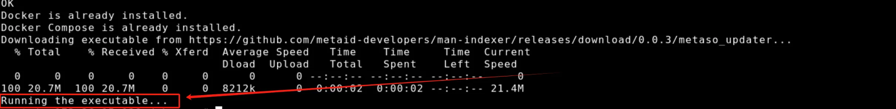
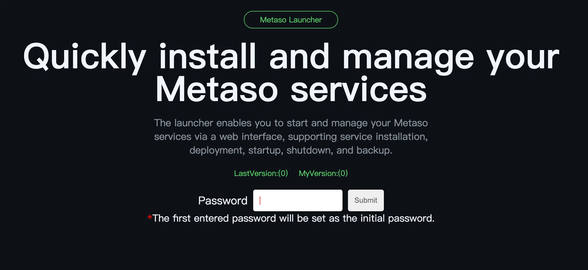

# MetaSo

MetaSo is an open-source decentralized service package based on MetaID-v2 and MAN. It integrates fundamental on-chain MetaID social data, similar to Bitcoin nodes, making it easy for anyone to run a decentralized social node. Unlike Bitcoin nodes, MetaSo focuses solely on social data rather than transaction data.

# Base Protocols

### Public Social Protocols: simplebuzz/paylike/paycomment/simplerepost

**simplebuzz**

path: `/protocols/simplebuzz`

```json
{
    "content": "{Content}",
    "contentType": "{Content Format, default is text/plain}",
    "quotePin": "{Referenced/Quoted PinID}",
    "attachments": [
        "{metafile://PinID1}",
        "{metafile://PinID2}"
    ],
    "mention": [
        "{metaID1}",
        "{metaID2}"
    ]
}
```

**paylike**

path: `/protocols/paylike`

```json
{
    "isLike": "1",
    "likeTo": "9bc429654d35a11e5dde0136e3466faa03507d7377769743fafa069e38580243i0"
}
```

[Additional protocol definitions...]

# Installation Guide

To make MetaSo accessible to everyone, all programs are packaged into a single installation package, including one-click upgrade handling, ensuring all MetaSo nodes across the network can stay in sync.

PS: If you need to view the tutorial on how to purchase a server, please refer to this tutorial.

## Quick Installation

1. Execute the following command on your server to start the installer:
```bash
wget -qO- https://github.com/metaid-developers/metaso/releases/download/v0.1/installmetaso_boot.sh | sudo bash
```


PS: If you need to delete and reinstall the installer, please refer to this tutorial.

2. Access the installer page at http://{server-IP}:7171 (port 7171 needs to be opened on your server)

   - Set initial password for installer security
   
   - Click "Install now" to proceed with installation
   
   - After installation is complete, you will see the following interface. If you see the 'Stop Service' button, it means that MetaSo is running normally and can be accessed. Click the 'Stop Service' button to stop MetaSo, and the 'Start service' button to start MetaSo.
   

3. Test the MetaSo service at http://{server-IP}:3000 (port 3000 needs to be opened)


4. Access admin settings at http://{server-IP}:3000/dashboardLogin


5. API documentation available at http://{server-IP}:7172 (Coming soon)

## Advanced Deployment

Coming soon

## Desktop Installation

Coming soon

## Upgrade Process

1. Visit http://{server-IP}:7171 to check current version against latest version
2. Click "Upgrade for latest" to perform the update


## Configuration

### Admin Account Setup
1. Modify `USERNAME` and `PASSWORD` in ./metaso/.env:
```
USERNAME=admin
PASSWORD=admin123456
```
2. Restart service through the installer page

### Additional Settings
- Customize appearance

- Set platform fees

- Configure blockchain RPC sources


## API Reference

**Common APIs:**
```
/social/buzz/newest         # Get latest buzz list
/social/buzz/hot           # Get trending buzz list
/social/buzz/info          # Get single buzz information
/social/buzz/interactive/info  # Get buzz interaction info
/social/user/info          # Get social information
```

## Troubleshooting

For common deployment issues and solutions, please refer to our [troubleshooting guide](link-to-troubleshooting).

## Security Notes

- Always secure your admin credentials
- Regularly update your installation
- Configure firewalls appropriately
- Back up your configuration files

## Contributing

We welcome contributions! Please see our contributing guidelines for more details.

## License

[License Information TBD]
