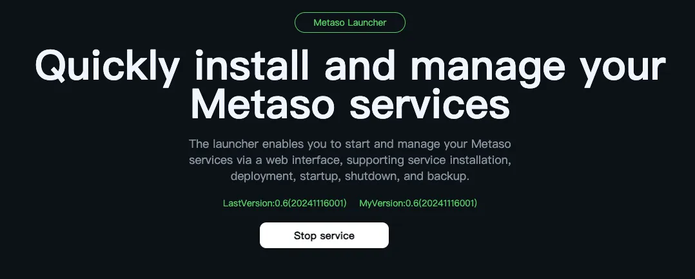
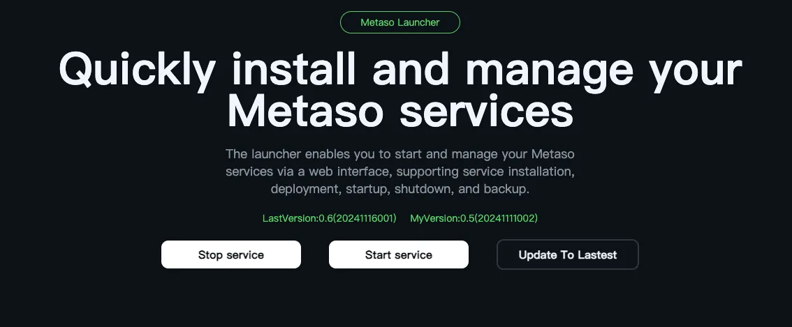
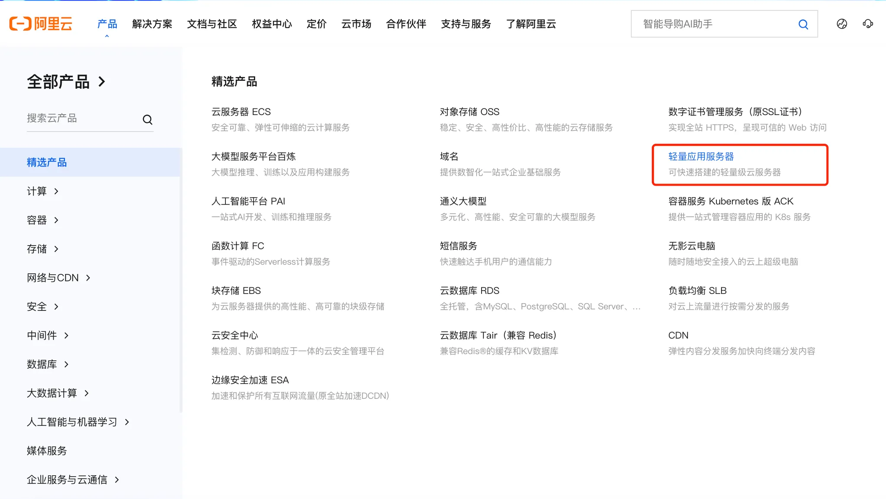
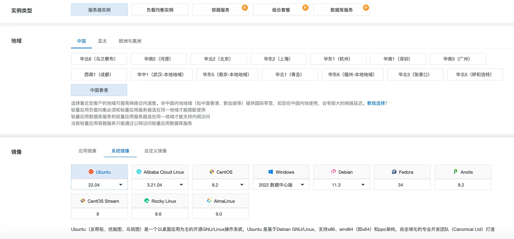
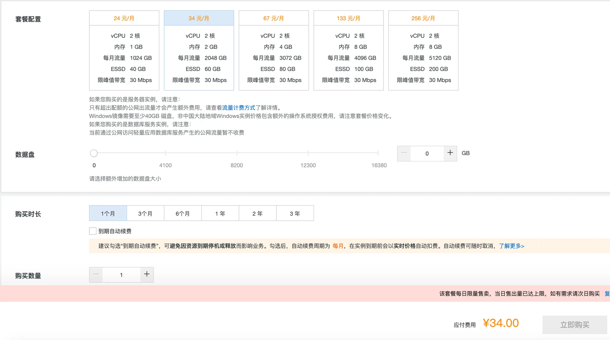
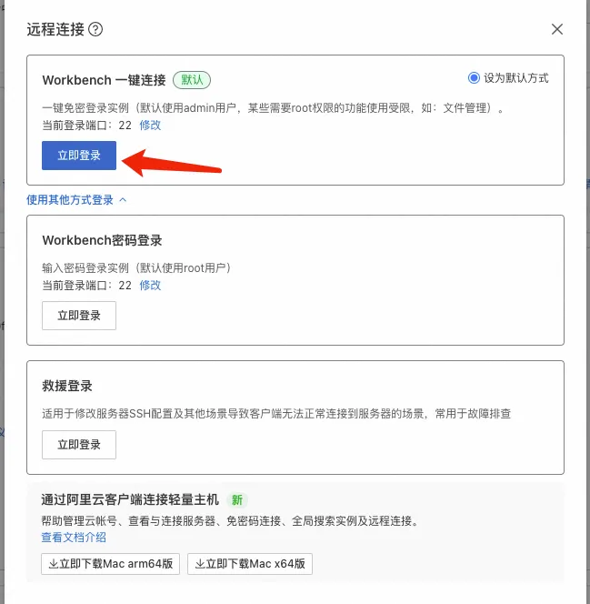
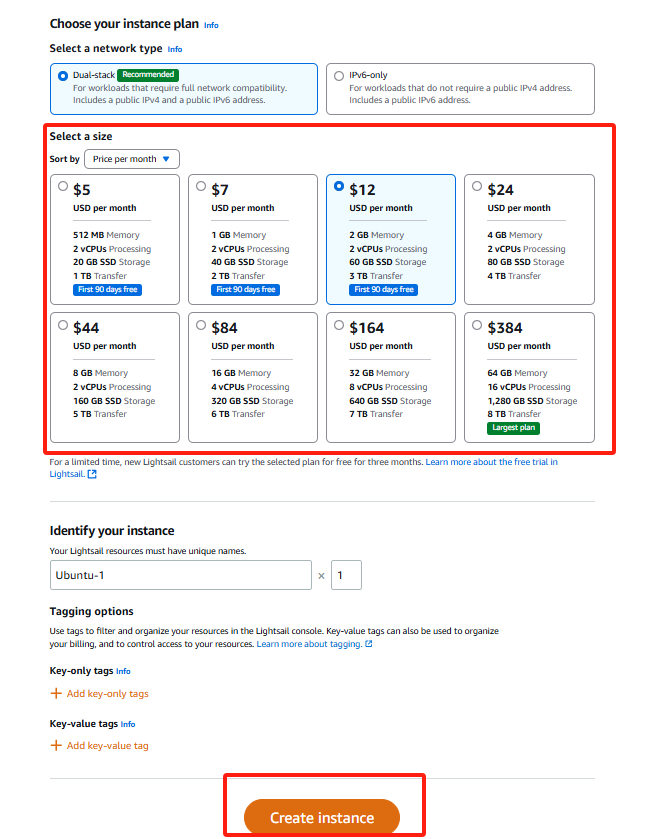

# MetaSo

[](README.md)
[](README-zh.md)

MetaSo is an open-source decentralized service package based on MetaID-v2 and MAN. It integrates fundamental on-chain MetaID social data, similar to Bitcoin nodes, making it easy for anyone to run a decentralized social node. Unlike Bitcoin nodes, MetaSo focuses solely on social data rather than transaction data.

# Base Protocols

### Public Social Protocols: simplebuzz/paylike/paycomment/simplerepost

**SimpleBuzz**

path: `/protocols/simplebuzz`

```json
{
    "content": "{Content}",
    "contentType": "{Content Format, default is text/plain}",
    "quotePin": "{Referenced/Quoted PinID}",
    "attachments": [
        "{metafile://PinID1}",
        "{metafile://PinID2}"
    ],
    "mention": [
        "{metaID1}",
        "{metaID2}"
    ]
}
```

**PayLike**

path: `/protocols/paylike`

```json
{
    "isLike": "1",
    "likeTo": "9bc429654d35a11e5dde0136e3466faa03507d7377769743fafa069e38580243i0"
}
```

**PayComment**

path: `/protocols/paycomment`

```json
{
	"content":"Nice comment",
	"commentTo":"c36feccf58b1a83c4df8a0b1517b74cf147509c1e25f4796ec493b1579a263f5i0",
	"replyTo":"", 
	"pay":"",
	"payTo": "",
}
```

**SimpleRepost**

path: `/protocols/simplerepost`

```json
{
	"rePostComment":"let me repost thisbuzz",
	"rePostTx:":"c36feccf58b1a83c4df8a0b1517b74cf147509c1e25f4796ec493b1579a263f5i0",
}
```

### Permission Protocols: PayBuzz/SubscribeBuzz/AccessControl/AccessPass

**PayBuzz**

path: `/protocols/paybuzz`

```json
{
    "publicContent": "{The public content}", // public preview part
    "encryptContent": "{Encrypted Content}", // encrypted content
    "contentType": "{Content Format, default is text/plain}",
    "publicFiles": [
		    "metafile://{pinid-1}", 
			  "metafile://{pinid-2}",
			  ...,
	],
    "encryptFiles": [
		    "metafile://{pinid-21}", 
		    "metafile://{pinid-22}",
		    ...,
		 ],
}
```

**SubscribeBuzz**

path: `/protocols/subscribebuzz`

```json
{
    "publicContent": "{The public content}", // public preview part
    "encryptContent": "{Encrypted Content}", // encrypted content
    "contentType": "{Content Format, default is text/plain}",
    "publicFiles": [
		    "metafile://{pinid-1}", 
			  "metafile://{pinid-2}",
			  ...,
	],
    "encryptFiles": [
		    "metafile://{pinid-21}", 
		    "metafile://{pinid-22}",
		    ...,
		 ],
}
```

**AccessControl**

path: `/metaaccess/accesscontrol`

```json
{
    "publicContent": "public part of content",//public part of content
	"publicPins":["PINID-1", "PINID-2"],//public pins
	"publicPath": "/protocols/simplepublicbuzz",//public path
	"controlPins":["PINID1","PINID2"], //Array of 'paybuzz' PINs that will be in control of accessing
	"controlPath": "/protocols/metaaccess/subscribebuzz",//The 'subscribebuzz' pins which is in this path will be in control of accessing
	"manDomain":"",//man domain
	"manPubkey":"THE-PUBKEY-OF-MAN", //Pubkey of the MAN node providing custody decryption services.
	"creatorPubkey":"THE-PUBKEY-OF-CREATOR",//Pubkey of the creator
	"encryptedKey":"Use the ECDH Key to Decrypt it and use that decryptedkey to decrypt the content",
	"holdCheck":{//hold check
		"type":"mrc20" //"chainCoin" or "mrc20", 
		"ticker":"mc" //the ticker of mrc20;if type = chainCoin then it will be ignored
		"amount":"1000"
	},
	"payCheck":{//pay check
		"type":"chainCoin", //"chainCoin" or "mrc20"
		"ticker":"",
		"amount":"0.00001",
		"payTo":"address",
		"validPeriod": "4320", //blocks，4320 means 1 month
	},
}
```

**AccessPass**

path: `/metaaccess/accesspass`

```json
{
	"accessControlID":"the-pinid-of-accesscontrol-file"
}
```

# Installation Guide

To make MetaSo accessible to everyone, all programs are packaged into a single installation package, including one-click upgrade handling, ensuring all MetaSo nodes across the network can stay in sync.

PS: If you need to view the tutorial on how to purchase a server, please refer to this [tutorial](#how-to-purchase-a-server).

## Quick Installation

1. Execute the following command on your server to start the installer:

    ```bash
    wget -qO- https://github.com/MetaSo-Labs/metaso_updater/releases/download/pro/install_metaso_boot.sh | sudo bash
    ```

    

    PS: If you need to delete and reinstall the installer, please refer to this [tutorial](#how-to-remove-the-installer).

2. Access the installer page at http://{server-IP}:7171 (port 7171 needs to be opened on your server)

    

   - Set initial password for installer security

   

   - Click "Install now" to proceed with installation

   

   - After installation is complete, you will see the following interface. If you see the 'Stop Service' button, it means that MetaSo is running normally and can be accessed. Click the 'Stop Service' button to stop MetaSo, and the 'Start service' button to start MetaSo.

   

3. Test the MetaSo service at http://{server-IP}:3000 (port 3000 needs to be opened)

    

4. Access admin settings at http://{server-IP}:3000/dashboardLogin

    

5. API documentation available at http://{server-IP}:7172 (Coming soon)

## Advanced Deployment

Coming soon

## Desktop Installation

Coming soon

## Upgrade Process

1. Visit http://{server-IP}:7171 to check current version against latest version
2. Click "Upgrade for latest" to perform the update


## Configuration

### Admin Account Setup
1. Modify `USERNAME` and `PASSWORD` in ./metaso/.env:
```
USERNAME=admin
PASSWORD=admin123456
```
2. Restart service through the installer page

### Additional Settings
- Customize appearance

- Set platform fees

- Configure blockchain RPC sources


## API Reference

**Common APIs:**
```
/social/buzz/newest         # Get latest buzz list
/social/buzz/hot           # Get trending buzz list
/social/buzz/info          # Get single buzz information
/social/buzz/interactive/info  # Get buzz interaction info
/social/user/info          # Get social information
```

## Troubleshooting

### How to Purchase a Server

1. Alibaba Cloud
    1. Log in to your Alibaba Cloud account
    2. Select "Lightweight Application Server" under Products and click "Buy Now"
        
        
    3. Configure your instance:
        - Instance Type: "Server Instance"
        - Region: "Hong Kong"
        - Image: Ubuntu 22.04 or higher
        - Package configuration and data disk can be selected according to your needs
        
        
    4. Click "Buy Now"
    5. Go to the console, enter your server instance, click "Remote Connection" and "Login Now"
        
        
    6. Before installing MetaSo, ensure your system is up to date by running: `sudo apt update && sudo apt upgrade -y`
        

2. Amazon AWS
    1. Log in to your Amazon AWS account
    2. Select "Compute" under Products and click "LightSail"
        
        
    3. Create an instance:
        - Region: "Singapore"
        - Image: Ubuntu 22.04 or higher
        - Package configuration and data disk can be selected according to your needs
        
        
    4. After creation, return to the console, enter your server instance, click "Remote Connection" and "Login Now"
        
    5. Before installing MetaSo, ensure your system is up to date by running: `sudo apt update && sudo apt upgrade -y`
        

### How to Open Ports on Your Server

1. Alibaba Cloud
    1. Go to your server instance, click "Firewall", then "Add Rule"
        
    2. Enter the port range you need to open (e.g., 7171 or 3000) and click "Confirm"
        

2. Amazon AWS
    1. Enter your server instance, click "Networking", then "Add Rule"
        
    2. Enter the port range you need to open (e.g., 7171 or 3000) and click "Create"
        

### Cannot Access http://{server-IP}:7171 After Deployment

1. Check Firewall Status
    You can check the firewall status on Linux systems using these methods:

    1. Using `ufw` (if installed)
        ```bash
        sudo ufw status
        ```
        - Status: inactive means ufw is not enabled
        - Status: active shows which ports are allowed/blocked

    2. Using `firewalld` (if installed)
        ```bash
        sudo systemctl status firewalld
        ```
        - active (running) means firewalld is enabled
        - inactive means firewalld is not enabled

    3. Using `iptables`
        ```bash
        sudo iptables -L
        ```
        This command lists current iptables rules showing allowed/blocked ports

2. Configure Firewall Ports
    1. Using `ufw`
        ```bash
        sudo ufw status
        sudo ufw allow 7171/tcp
        ```

    2. Using `iptables`
        ```bash
        sudo iptables -L
        sudo iptables -A INPUT -p tcp --dport 7171 -j ACCEPT
        ```

### How to Remove the Installer
1. Delete the `./metaso` folder and `metaso_boot.db`
2. Run `sudo lsof -i:7171` and kill the process using `sudo kill {PID}`
3. Delete the `/metaso` directory from the system root

### Forgot Admin Dashboard Credentials?
1. Modify `USERNAME` and `PASSWORD` in ./metaso/.env:
    ```
    ######### MetaSO ##################
    USERNAME=admin
    PASSWORD=admin123456
    ```
2. Visit http://{server-IP}:7171, click "Stop Service" then "Start Service" to restart and apply changes

## Security Notes

- Always secure your admin credentials
- Regularly update your installation
- Configure firewalls appropriately
- Back up your configuration files

## Contributing

We welcome contributions! Please see our contributing guidelines for more details.

